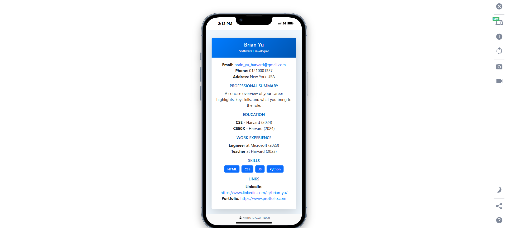
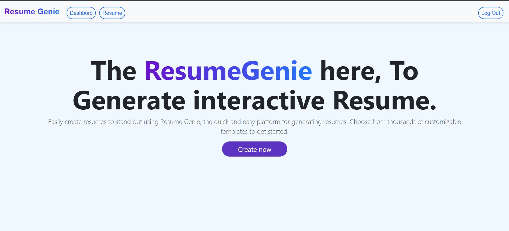

# 📝 "Resume Genie: An Interactive Resume Builder". 


---


## 📌 Overview

**Resume Genie** is built to help users craft compelling resumes with minimal effort. Users can enter their personal and professional details, and the application automatically formats the information into a well-structured resume. The system supports multiple resumes per user, making it ideal for professionals with diverse career goals.

---

## 💻 Technologies Used

| **Category**     | **Technologies**                                     |
|-------------------|-----------------------------------------------------|
| **Backend**      | Python, Flask                                       |
| **Frontend**     | HTML, CSS, JavaScript, Bootstrap                    |
| **Database**     | SQLite                                             |
| **Other Tools**  | JSON for structured data storage, Flask sessions for user management |

---

## 🌐 Video link
Check out the live application here: link share here

---

## 📸 Screenshots

| Device  | Screenshot                                                                                   |
|---------|---------------------------------------------------------------------------------------------|
| Mobile  |                                  |
| Desktop |                                |

---

## Features
- 🔐 **User Authentication:**: Choose from modern, creative, or minimalist designs.
- 🛠️ **User-Friendly Interface**: Fill in your details with a guided form.
- 📤 **Export Options**: Download your resume as a PDF or share it online.
- 🌐 **Responsive Design**: Optimized for desktop and mobile devices.
- 💾 **sqlite3**: Save your progress and resume drafts.
- 📂 **Resume Management**: Create, edit, and store multiple resumes.
- 🗂️ **JSON Data Storage**: Save complex data such as education, work experience and skills in a structured format.
- 📱 **Mobile-Friendly Design**: Fully responsive UI for all devices.
- ⚠️ **Error Handling**: Friendly error messages and form validation.


--- 
## 🚀 Installation

Follow these steps to set up the application on your local machine:

1. **Clone the Repository** 

Open your terminal and run the following command to clone the repository:

```bash
git clone https://github.com/GiasuddinvuiyaBD/interactive-resume-builder.git
```
2. Navigate to the Project Directory

Change the project diractory
```bash
cd interactive-resume-builder
```

3. Create and Activate a Virtual Environment
Create a virtual environment to isolate dependencies:
```base 
python3 -m venv venv
```

Activate the virtual environment:
- On Linux/Mac
    ```bash
    source venv/bin/activate
    ```
- On Window
    ```bash
    venv\Scripts\activate
    ```

4. Install Required Dependencies

Install the necessary Python packages:
```bash
pip3 install flask
pip3 install flask_session
pip3 instal cs50
```

5. Run the project
```bash
flask run
```

The application will be available at `http://127.0.0.1:5000`.


--- 
## 🛠️ Usage
### How to Use the Application

1. **Register/Login**: Create an account or log in with an existing one.

2. **Create a Resume**:
    - Navigate to the "Create Resume" page.
    - Fill in the form with your details (e.g., personal-Info, education-details, skills.).

3. **Download or Print**:
    - Download your resume as a PDF or print it directly from the browser.

---
## Project Structure

```base 
resume-genie/ 
├── app.py # Main application logic 
├── templates/ # HTML templates 
├── static/ # CSS, JS, and image files 
├── database/ # SQLite database 
├── requirements.txt # Python dependencies 
└── README.md # Project documentation
```

## Future Enhancements

- Add real-time resume preview functionality.

- Implement additional customizable templates.

- Enable export to Word and other file formats.

- Introduce AI-based suggestions for resume improvement.


## Contributing
Contributions are welcome! If you'd like to contribute, please:

1. Fork the repository.

2. Create a new branch (`git checkout -b feature-name`).

3. Commit your changes (`git commit -m 'Add feature'`).

4. Push to the branch (`git push origin feature-name`).

5. Open a Pull Request.

--- 


## 👤 Contact
For any questions or feedback, feel free to reach out:


- Email : giasuddinvuiya2022@gmail.com
- gitHub : [GiasuddinvuiyaBD](https://github.com/GiasuddinvuiyaBD)

--- 


## 🙏 Acknowledgments
Special thanks to:

- **CS50x Team**: For providing an excellent introduction to computer science and inspiring me to create this project as my final submission.
- **David J. Malan and the Harvard CS50 Team**: For the engaging lectures, problem sets, and invaluable learning resources.
- **Family and Friends**: For their encouragement and support throughout the development of this project.
- **Flask Documentation**, **SQLite Community**, **Bootstrap Framework**, and **OpenAI** for their invaluable tools and resources that supported the development of this project.

--- 
## License
This project is licensed under the MIT License.
